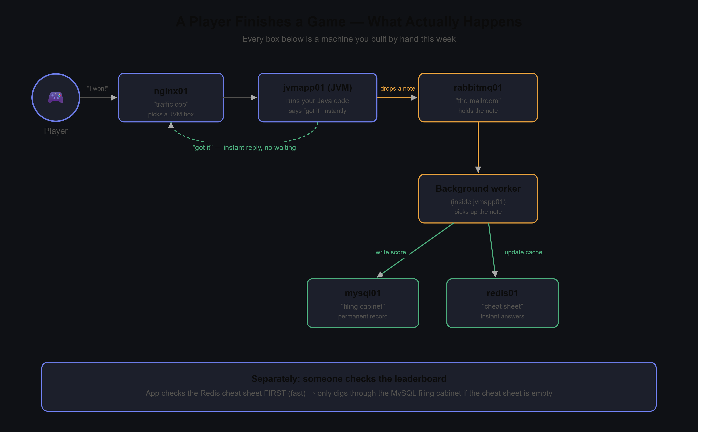

# noc-to-sre-lab

A personal homelab built to go from NOC-level "watch the dashboard" work to actual SRE skills —
infra-as-code, CI/CD, observability, and (eventually) automated root-cause analysis. It mirrors a
real Azure-hosted gaming platform's shape (nginx → app tier → MySQL/Redis/RabbitMQ), but runs
entirely on self-hosted VMware VMs instead of the cloud, so every layer — provisioning,
configuration, deployment, monitoring, logging — gets built and debugged by hand first.

Everything here is real and has actually been run against the live fleet: no task in this repo is
marked done until it's been verified against the running system, not just "the playbook said
`changed`." The full blow-by-blow of what broke and how it got fixed lives in
[`docs/journal/`](docs/journal/) — that's the actual point of this project, not just the end state.

Built and maintained by [Marc Anthony Marquez](https://github.com/blueheaven181). Started 2026-08-06.



## The fleet

| Host        | IP             | Role                                              |
|-------------|----------------|----------------------------------------------------|
| controller01| 192.168.11.10  | Ansible control node; runs the observability stack (Prometheus, Grafana, Elasticsearch, Logstash, Kibana) via Docker Compose |
| nginx01     | 192.168.11.11  | Reverse proxy / load balancer                     |
| mysql01     | 192.168.11.12  | MySQL data tier                                    |
| redis01     | 192.168.11.13  | Redis cache tier                                   |
| rabbitmq01  | 192.168.11.14  | RabbitMQ messaging tier                            |
| jvmapp01/02 | 192.168.11.15/16 | `game-service` (Spring Boot) app tier            |
| winsrv01    | 192.168.11.20  | Windows Server 2022 — CI/CD build agent            |

RHEL 9.5 for everything except winsrv01. All on a VMware host-only/NAT network.

Request path:

```
Player → nginx01 (round-robin) → jvmapp01 / jvmapp02
                                        │
                                        ├─→ RabbitMQ (async event bus)
                                        │        └─→ listener → MySQL (durable) + Redis (cache)
                                        │
       leaderboard reads ←──────────────┴── Redis first, MySQL on cold start
```

Proven end-to-end on 2026-08-16: a real `POST /api/session/complete` propagating through RabbitMQ to
a MySQL write and a Redis update, reflected in `GET /api/leaderboard` in roughly two seconds.

## Stack

- **Provisioning**: VMware VMs, currently built by hand (Terraform under `terraform/azure` and
  `terraform/local` is planned, not implemented yet)
- **Configuration & deployment**: Ansible (`ansible/`) — one role per tier, tag-scoped plays,
  secrets in an `ansible-vault`-encrypted file
- **App**: `game-service` (`app/game-service/`) — Spring Boot 3, MySQL + Redis + RabbitMQ,
  Actuator/Micrometer instrumented
- **CI/CD**: GitHub Actions — builds the jar on push to `app/game-service/**` and commits it back to
  the repo; Ansible handles the actual deploy
- **Observability**: Prometheus + Grafana for metrics, the ELK stack for logs (`docker/`) —
  Filebeat on the RHEL fleet, Winlogbeat on winsrv01, dashboards checked into `dashboards/`
- **Hardening**: SELinux stays `enforcing`; every exporter port gets a `firewalld` rule scoped to the
  lab subnet rather than `0.0.0.0/0`

## What actually broke

The journals are the substance of this project. A representative selection:

**A real infrastructure crash, with two stacked root causes.**
Kernel-level NVMe I/O timeouts and XFS filesystem shutdowns took down `jvmapp01`, `jvmapp02`, and
`controller01` mid-session. Diagnosis separated two independent causes rather than stopping at the
first: host-wide memory overcommit from running eight VMs plus a new Docker stack, *and* per-VM
undersizing — `controller01` and `jvmapp01` had only ever been allocated ~1.6 GB each and were
already swap-thrashing on their own.

**Documentation that claimed something worked, which didn't.**
`architecture.md` recorded `windows_exporter` as live. It wasn't — no service registered, no binary
on disk. The working state seen earlier had almost certainly been a manually-started foreground
process that a reboot silently erased. Found by verifying rather than trusting the note.

**A symptom three layers away from its cause.**
`nginx01` failed a package install with `"No package vim-enhanced available."` The actual cause: that
host had never been registered with `subscription-manager` — the only one of seven in that state.

**Four independent bugs stacked behind one broken connection.**
The first Ansible play needing real WinRM to `winsrv01` surfaced a wrong `ansible_user`, a global
`become=True` in `ansible.cfg` that breaks WinRM, `pywinrm` never installed on the controller, and
`win_template` silently not rendering Jinja2 due to a collection/core version mismatch — each hidden
behind the one before it.

**A first automation run scoped deliberately.**
The first-ever Ansible run against live hosts was restricted to `--tags common` — a role that touches
no application state — because the vault didn't yet exist and the app-tier roles read credentials
from it. Running everything would have been faster and wrong.

Full write-ups in [`docs/journal/`](docs/journal/).

### What "verified" means here

- **Winlogbeat** — confirmed by querying Elasticsearch directly; `noclab-winlogbeat-*` held 5,955
  documents within minutes, including correctly-tagged Service Control Manager events
- **Grafana** — confirmed by logging in and checking every panel renders real data, not merely that
  the provisioning file loaded
- **Exporters** — `7/7 UP` on the Prometheus targets page, and `2/2 up` for `game_service` across
  both app hosts

## Status

- **Phases 1–3** (fleet build, app deploy, first monitoring pass): done
- **Phase 4** (full observability — exporters, CI/CD, app metrics, dashboards, logs): functionally
  complete as of 2026-08-20 — see [`docs/architecture.md`](docs/architecture.md) for what's live
  vs. still planned (more per-tier Grafana dashboards are the main thing left)
- **Phase 5** (AI-driven incident summarization / anomaly detection / automated RCA): not started,
  unscoped — the actual end goal of this project, now buildable since there's real metrics and log
  data across the fleet to reason over

## Known limitations

Recorded deliberately — this is the honest state of the lab, not a list of oversights:

- **Latency is an average, not percentiles.** `http_server_requests_seconds` is exposed as a
  Prometheus summary rather than a histogram, so no `_bucket` series exist to compute p50/p95/p99
  from. Enabling `percentiles-histogram` in the Actuator config fixes it — not yet done.
- **Dashboards cover one tier.** `game-service` is live with 14 panels; fleet, nginx, MySQL, Redis,
  and RabbitMQ dashboards are not built.
- **No alerting.** Alertmanager is deferred until there's a baseline of what normal looks like.
  Alerting on guessed thresholds produces noise, which trains people to ignore alerts.
- **Grafana and Kibana run on default credentials**, reachable only behind the firewalld restriction.
  Fine for a lab; noted explicitly so it never ships that way by accident.
- **Elasticsearch has no retention policy.** The Docker volume grows unbounded until one exists.
- **Deployment is not automated.** A successful CI build doesn't trigger
  `ansible-playbook --tags jvm_app`. Wiring that requires SSH secrets in GitHub Actions — a decision
  worth making deliberately rather than defaulting into.

## Running it

From controller01, with the fleet already provisioned and `inventory/group_vars/all/vault.yml`
in place:

```bash
cd ansible
ansible-playbook site.yml --ask-vault-pass --ask-become-pass          # everything
ansible-playbook site.yml --tags jvm_app --ask-vault-pass --ask-become-pass   # one tier
```

See the comments at the top of `ansible/site.yml` for the full prereqs and per-tag breakdown
(some tags need the vault, some don't).

The observability stack runs via Docker Compose on controller01:

```bash
cd docker
docker compose up -d
```

## Docs

- [`docs/architecture.md`](docs/architecture.md) — current design, what's live, what's next
- [`docs/journal/`](docs/journal/) — the actual learning log: what broke, why, and how it got
  fixed, written up after every real debugging session
